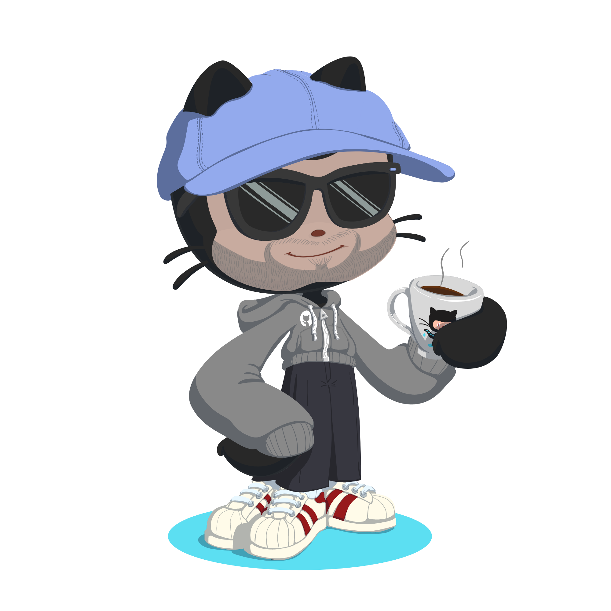

<!-- About me --->

  
  

       
  📍 I'm a physicist pursuing a PhD in artificial intelligence.    
  🌟 I'm interested in robotics, data science and any challenge!    
  🧠 I'm currently developing ROS robitcs packages.      
    
    
    
    

 
 
<!-- Vercel badges --->

